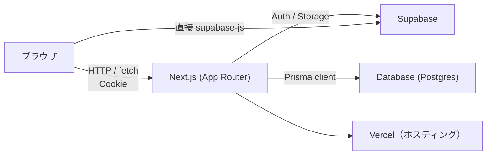

```mermaid

flowchart LR
  Browser["ブラウザ"] -->|HTTP / fetch<br/>Cookie| NextApp["Next.js (App Router)"]
  NextApp -->|Auth / Storage| Supabase["Supabase"]
  NextApp -->|Prisma client| DB["Database (Postgres)"]
  Browser -->|直接 supabase-js| Supabase
  NextApp --> Vercel["Vercel（ホスティング）"]
```
